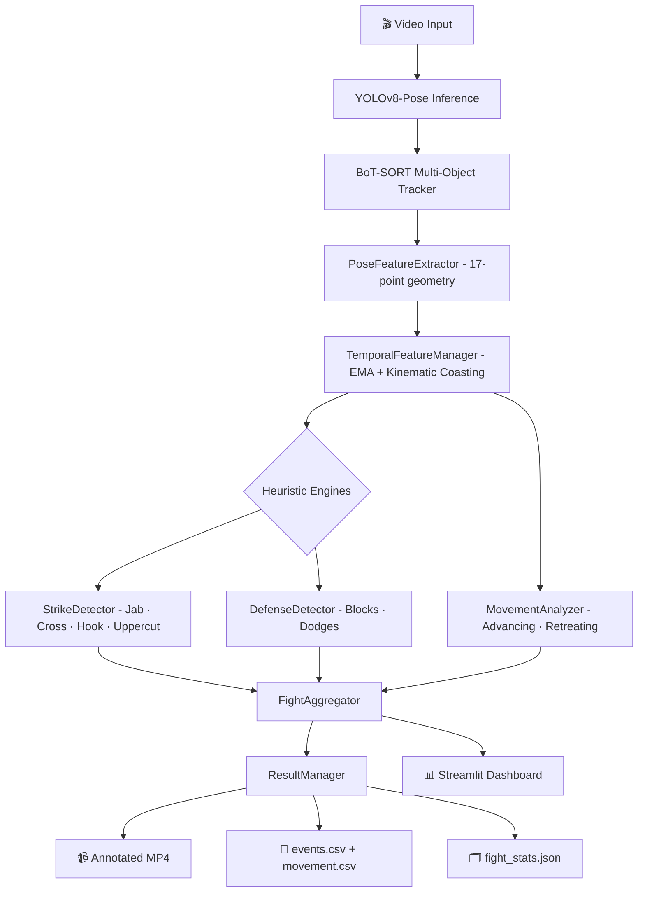

<div align="center">

# 🥊 Boxing AI Performance Analyzer

<p align="center">
  
  
  
  
  
</p>

<p align="center">
  <b>A real-time computer vision system that turns raw boxing footage into quantified performance intelligence.</b><br/>
  Pose estimation · Strike classification · Defensive analytics · Live HUD · Interactive dashboard
</p>

---

</div>

## 🧠 What Is This?

**Boxing AI Performance Analyzer** is an experimental Computer Vision pipeline that processes standard 2D boxing video and produces a rich, frame-level breakdown of fighter performance — entirely **without any labeled training data or supervised action classifiers**.

It extracts 17-point skeletal keypoints per fighter using **YOLOv8-Pose**, maintains stable cross-frame identities via **BoT-SORT** tracking, and runs a custom **temporal smoothing + kinematic coasting** layer to produce stable velocity and acceleration signals. On top of that, a set of rigorously tuned geometric heuristics classify every detected punch (Jab / Cross / Hook / Uppercut), estimate defensive actions (Blocks / Dodges), and predict strike outcomes (Landed / Blocked / Missed).

The result is an annotated MP4 with a live HUD overlay, a full event log, and an interactive **Streamlit dashboard** — all from a single video file.

> **Tested on:** Canelo Álvarez vs. Gennady Golovkin II — 5,254 frames at 1080p / 25 FPS → **168 detected strike events** with per-frame physical diagnostics.

---

## ✨ Feature Highlights

| Capability | Detail |
|---|---|
| 🦴 **Skeletal Tracking** | 17 COCO keypoints per fighter via YOLOv8n-Pose |
| 🔁 **Identity Persistence** | BoT-SORT tracks fighters across occlusions and crossings |
| 📉 **Temporal Smoothing** | Per-joint EMA with adaptive jitter gating and 5-frame kinematic coasting |
| 👊 **Strike Detection** | Velocity + arm-extension heuristics with 20-frame cooldown debounce |
| 🥋 **Punch Classification** | Jab, Cross, Hook, Uppercut — classified by 2D wrist trajectory vector |
| 🛡️ **Defense Detection** | Guard-proximity blocks + body-relative head-motion dodge detection |
| 🎯 **Outcome Estimation** | Landed / Blocked / Missed / Feint — via wrist-to-opponent-bbox intersection |
| 📊 **Multi-signal Confidence** | Velocity × Extension × Keypoint Quality × Proximity (practical range: 0.2–0.8) |
| 🎥 **Annotated Video** | Skeleton overlays, movement trails, floating event popups, HUD |
| 📈 **Interactive Dashboard** | Streamlit app with Plotly charts for aggregated fight statistics |

---

## 🏗️ Architecture & Pipeline



### Key Engineering Decisions

**1. Temporal Smoothing with Kinematic Coasting**

Raw YOLO keypoints are noisy. Each joint gets its own `_PointHistory` instance that runs EMA smoothing (α = 0.35) and supports up to **5 frames of kinematic coasting** — if a keypoint disappears, the system extrapolates position using a damped velocity model (0.85 decay per frame) rather than hard-resetting. This prevents spurious strike/dodge events during momentary occlusions.

**2. Adaptive Jitter Gate**

Single-frame teleportation spikes (tracker glitches) are rejected by checking if a new keypoint exceeds a joint-specific maximum-jump threshold. A _second_ consecutive outlier frame triggers a genuine re-anchor, preventing the gate from permanently locking on a wrong position. Wrists get a wider budget (250 px) to handle fast punch acceleration; head/torso are stricter (120 px).

**3. Multi-Signal Strike Confidence**

The confidence formula computes four independent signals:

| Signal | Description | Weight |
|---|---|---|
| `vel_score` | Wrist speed relative to minimum threshold | 35% |
| `ext_score` | Arm extension ratio mapped to [0.55–0.95] | 30% |
| `kp_score` | YOLO elbow keypoint detection confidence | 20% |
| `prox_score` | Normalized wrist-to-opponent distance | 15% |

Practical ceiling ≈ **0.80**, preventing confidence saturation under normal movement.

**4. Body-Relative Head Motion for Dodge Detection**

To isolate genuine head movement from camera pan or full-body translation, the system computes the frame-to-frame delta of the `(head_pos − shoulder_center)` offset — cancelling camera and body motion. Only residual head-bob/weave velocity above threshold triggers a dodge event.

---

## 📦 Tech Stack

| Library | Version | Role |
|---|---|---|
| Python | 3.10+ | Core runtime |
| ultralytics | 8.3.x | YOLOv8-Pose model |
| PyTorch | 2.7.x | Deep learning backend |
| OpenCV | 4.9+ | Video I/O and frame rendering |
| BoT-SORT | via ultralytics | Multi-object tracking |
| Streamlit | 1.35+ | Interactive web dashboard |
| Plotly | 5.22+ | Charts and visualizations |
| NumPy / Pandas | latest | Numerical and tabular data |
| lapx | 0.5.5+ | Python 3.12+ compatible LAP solver |

---

## 🚀 Getting Started

### 1. Clone the repository

```bash
git clone https://github.com/WaseefUllahh/boxing-ai-performance-analyzer.git
cd boxing-ai-performance-analyzer
```

### 2. Install dependencies

> A virtual environment is strongly recommended.

```bash
python -m venv .venv

# Windows
.venv\Scripts\activate

# Linux / macOS
source .venv/bin/activate

pip install -r requirements.txt
```

> **Note:** PyTorch (`torch 2.7.x`) must be pre-installed. The `requirements.txt` pins `torchvision` and `ultralytics` to matching ABIs but intentionally omits `torch` to avoid unnecessary upgrades.

### 3. Verify your environment

```bash
python verify_env.py
```

This runs a full diagnostic of OpenCV, PyTorch, YOLO, and BoT-SORT to confirm your environment is correctly configured before running the pipeline.

---

## ▶️ Usage

### CLI Pipeline

Place your boxing video at `data/fight.mp4` and run:

```bash
python main.py
```

The pipeline processes every frame and saves results to a timestamped folder under `outputs/`.

### Interactive Dashboard

```bash
streamlit run dashboard/app.py
```

Upload a video via the web UI, trigger the full pipeline from the browser, and explore interactive Plotly charts for aggregated fight statistics.

---

## 📂 Output Files

After processing, the `outputs/<timestamp>/` directory contains:

| File | Description |
|---|---|
| `boxing_analysis.mp4` | Annotated video with skeleton overlays, movement trails, floating event popups, and transparent HUD |
| `events.csv` | Chronological log of every detected strike and defense — includes frame number, timestamp, confidence, classification, and outcome |
| `movement.csv` | Frame-by-frame fighter separation and movement state (advancing / retreating) |
| `fight_stats.json` | Final aggregated metrics per fighter — ready for API consumption |

---

## 🗂️ Project Structure

```
boxing-ai-performance-analyzer/
├── data/                       # Input video files
├── dashboard/
│   └── app.py                  # Streamlit web application
├── outputs/                    # Generated reports and annotated videos
├── src/
│   ├── temporal_features.py    # EMA smoothing, kinematic coasting, velocity/accel
│   ├── pose_features.py        # Raw 17-keypoint geometry extraction
│   ├── strike_detector.py      # Rule-based Jab/Cross/Hook/Uppercut classifier
│   ├── defense_detector.py     # Block and dodge heuristics
│   ├── movement_analyzer.py    # Advancing/retreating vector analysis
│   ├── fight_analyzer.py       # Aggregates raw events into summary stats
│   ├── tracker.py              # YOLOv8 + BoT-SORT wrapper
│   ├── video_processor.py      # Frame orchestrator and HUD renderer
│   ├── video_io.py             # OpenCV video reading and writing utilities
│   ├── result_manager.py       # CSV / JSON / MP4 export
│   └── events.py               # FightEvent dataclass definition
├── tests/                      # Unit tests
├── config.py                   # All tunable thresholds and global configuration
├── main.py                     # CLI entry point
├── verify_env.py               # System diagnostic tool
└── requirements.txt            # Pinned dependencies
```

---

## ⚠️ Known Limitations

> [!WARNING]
> This is an experimental research prototype. All outputs are **geometric estimates** and have **not been validated against ground-truth boxing annotations**.

- **No glove detector** — wrists are tracked via the generic YOLO pose skeleton. Boxing gloves can alter the apparent wrist position.
- **Heuristic outcomes only** — "Landed" / "Missed" / "Blocked" are estimated by intersecting the wrist trajectory with the opponent's 2D bounding box, not by physical contact detection.
- **No labeled training data** — strike and defense classification is fully rule-based geometry, not a learned model.
- **Camera-dependent** — tracking degrades significantly under severe motion blur, unusual camera angles, or heavy occlusion.
- **Not for official scoring** — results should not be used for professional judging or officiating.

---

## 🔭 Roadmap

| Priority | Item | Description |
|---|---|---|
| 🔴 High | **Custom Glove Detector** | Train a dedicated YOLO model on boxing gloves to replace generic wrist tracking |
| 🔴 High | **Learned Punch Classifier** | Replace geometric heuristics with an LSTM or 3D-CNN trained on labeled boxing actions |
| 🟡 Medium | **Labeled Boxing Dataset** | Curate and annotate boxing footage for supervised learning of strike and defense types |
| 🟡 Medium | **Camera Calibration** | Map 2D pixel coordinates to 3D real-world space for accurate velocity in m/s |
| 🟡 Medium | **Robust ReID** | Re-Identification model for fighters in matching gear |
| 🟢 Low | **True Round Detection** | Auto-detect round boundaries via ringside clock OCR or referee detection |
| 🟢 Low | **Model Evaluation Framework** | Precision / Recall / F1 benchmark against ground-truth strike annotations |
| 🟢 Low | **AI Coaching Layer** | Generative AI feedback with natural-language coaching insights from aggregated stats |

---

<div align="center">

Built with Python, PyTorch, and a lot of geometric algebra. 🥊

</div>