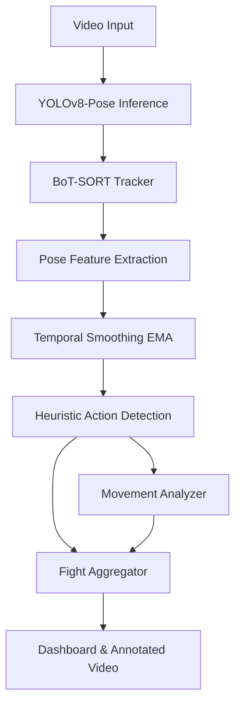

# Boxing AI Performance Analyzer

The **Boxing AI Performance Analyzer** is an experimental Computer Vision system designed to evaluate and quantify boxing performance from 2D video footage. By extracting skeletal structures and calculating spatial-temporal movement, the analyzer estimates a boxer's performance by counting strikes, identifying stances, logging defensive maneuvers, and visualizing movement patterns. 

Built entirely on heuristic geometric modeling rather than supervised action-classification models, this tool serves as a foundational proof-of-concept for automated combat sports analytics.

## Technologies

- **Core**: Python 3.10+
- **Computer Vision**: OpenCV, Ultralytics YOLOv8
- **Deep Learning**: PyTorch
- **Tracking**: BoT-SORT
- **Dashboard & Visualization**: Streamlit, Plotly, Pandas

## Current MVP

The Minimum Viable Product (MVP) is currently functional and capable of the following:
- Tracking up to two fighters in a standard 2D video feed.
- Extracting 17-point skeletal keypoints using YOLOv8-Pose.
- Deriving basic geometric features (wrist velocity, arm extension, stance width).
- Estimating strike categories (Jab, Cross, Hook, Uppercut) using hardcoded trajectory heuristics.
- Estimating defensive maneuvers (Blocks, Dodges) based on guard proximity and head displacement.
- Outputting an annotated MP4 video with a live HUD and providing a Streamlit dashboard to view aggregated statistics.

## Architecture & Pipeline

The system is built on a modular, multi-stage, frame-by-frame processing pipeline.



### 1. YOLO Pose
We use `yolov8n-pose` (Nano) to perform single-shot human pose estimation. For each detected person, YOLO outputs a bounding box and 17 COCO keypoints (x, y, confidence) corresponding to joints like wrists, elbows, shoulders, and ankles.

### 2. BoT-SORT Tracking
To maintain fighter identities across frames and handle temporary occlusions, the system utilizes **BoT-SORT** (an advanced multi-object tracker). It relies on bounding box IoU and motion prediction to assign a consistent Track ID to each fighter.

### 3. Pose-Based Feature Extraction
Raw keypoints are inherently noisy. The `PoseFeatureExtractor` calculates geometric relationships (e.g., shoulder width, torso lean, arm extension). These raw spatial coordinates are then passed through a **Temporal Smoothing** layer, which applies an Exponential Moving Average (EMA) to stabilize the points and derive stable frame-to-frame velocities and accelerations.

### 4. Heuristic Strike Detection
Strike classification is strictly rule-based. The `StrikeDetector` does not use a trained neural network to recognize a punch. Instead, it measures the magnitude and direction of the wrist velocity. If the velocity exceeds a threshold and the arm reaches a minimum extension, a strike is registered. The specific punch type (Jab, Hook, Uppercut) is classified purely based on the 2D vector angle (e.g., an upward vertical vector registers as an Uppercut).

## Installation

1. **Clone the repository:**
   ```bash
   git clone https://github.com/yourusername/boxing-ai-performance-analyzer.git
   cd boxing-ai-performance-analyzer
   ```

2. **Install dependencies:**
   It is highly recommended to use a virtual environment.
   ```bash
   pip install -r requirements.txt
   ```

3. **Verify Environment:**
   Run the environment diagnostics script to ensure OpenCV, PyTorch, and YOLO dependencies are correctly configured on your OS:
   ```bash
   python verify_env.py
   ```

## Usage

### Command-Line Pipeline
Process a video and generate the annotated output and raw data files.
```bash
python main.py
```
*(By default, this analyzes `data/fight.mp4` and exports the results to the `outputs/` directory.)*

### Interactive Dashboard
Launch the Streamlit web app to upload a video, run the pipeline, and visualize the interactive charts.
```bash
streamlit run dashboard/app.py
```

## Example Outputs

When a video is processed, the system generates a timestamped folder in `outputs/` containing:
- **`boxing_analysis.mp4`**: The original video rendered with bounding boxes, skeletal overlays, movement trails, floating event popups, and a transparent statistics HUD.
- **`events.csv`**: A chronological log of every detected strike and defensive move, including frame numbers, confidence scores, and heuristic classifications.
- **`movement.csv`**: Frame-by-frame data on fighter separation and relative movement states (advancing/retreating).
- **`fight_stats.json`**: The final aggregated metrics for both fighters, ready for API consumption.

## Project Structure

```text
boxing-ai-performance-analyzer/
├── data/                  # Sample video inputs
├── dashboard/
│   └── app.py             # Streamlit web application
├── outputs/               # Generated reports and annotated videos
├── src/
│   ├── config.py          # Global thresholds and configuration
│   ├── defense_detector.py# Heuristics for blocks and dodges
│   ├── events.py          # Dataclasses for FightEvents
│   ├── fight_analyzer.py  # Aggregates raw events into summary stats
│   ├── movement_analyzer.py # Calculates advancing/retreating vectors
│   ├── pose_features.py   # Extracts geometry from keypoints
│   ├── result_manager.py  # Handles file exports (CSV, JSON, MP4)
│   ├── strike_detector.py # Heuristics for jabs, crosses, hooks, uppercuts
│   ├── temporal_features.py # EMA smoothing and velocity calculation
│   ├── tracker.py         # YOLO + BoT-SORT wrapper
│   ├── video_io.py        # OpenCV video reading and writing
│   └── video_processor.py # Orchestrates the pipeline and draws the HUD
├── tests/                 # Unit tests
├── main.py                # CLI entry point
├── requirements.txt       # Python dependencies
└── verify_env.py          # System diagnostic tool
```

## Known Limitations

> [!WARNING]
> This system is an experimental prototype. The outputs are **heuristic estimates** and have **not been scientifically validated** against ground truth boxing data.

- **No Custom Glove Detector**: The system tracks bare wrists via YOLO pose. It does not possess a specialized model to detect or track boxing gloves.
- **Estimated Heuristics Only**: "Landed", "Missed", and "Blocked" punches are estimated by intersecting the trajectory of a wrist with the 2D bounding box of the opponent. They do not represent guaranteed physical contact.
- **No Labeled Training Dataset**: Actions are determined by hardcoded geometry rules. No labeled dataset of boxing actions was used to train a classifier.
- **Fragile Tracking**: Tracking and stance detection rely heavily on camera angle, lighting, and occlusion. Crossed arms or extreme motion blur will cause the tracker to lose keypoints, severely degrading accuracy.
- **Not Official Scoring**: This application cannot and should not be used for official fight scoring.

## Future Work

To evolve this prototype into a production-grade analytics engine, the following roadmap is proposed:
- **Custom Glove Detector**: Train a dedicated object detection model specifically for boxing gloves to replace generic wrist tracking.
- **Trained Punch Classifier**: Replace geometric heuristics with an LSTM or 3D-CNN trained on a labeled boxing dataset to classify strikes accurately.
- **Labeled Boxing Dataset**: Curate a robust dataset of annotated boxing footage for supervised learning.
- **Stronger ReID**: Implement a robust Re-Identification model tailored for fighters (who often wear similar gear and lack upper body clothing).
- **Camera Calibration**: Map 2D pixel coordinates to 3D real-world space to accurately measure distance, reach, and velocity in standard metrics (m/s).
- **True Round Detection**: Automatically detect the start and end of rounds (e.g., via clock OCR or referee detection).
- **Model Evaluation**: Establish a ground-truth testing framework to formally measure Precision, Recall, and F1 scores for strike detection.
- **Coach Recommendation System**: Introduce a generative AI layer to provide automated, natural-language coaching feedback based on the generated stats.